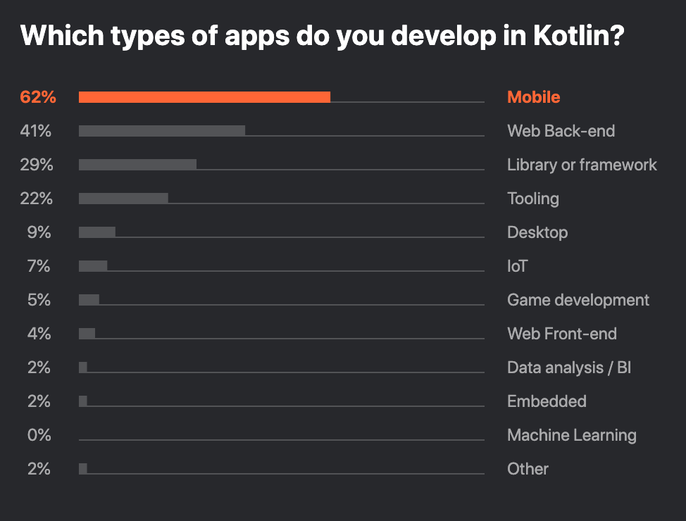
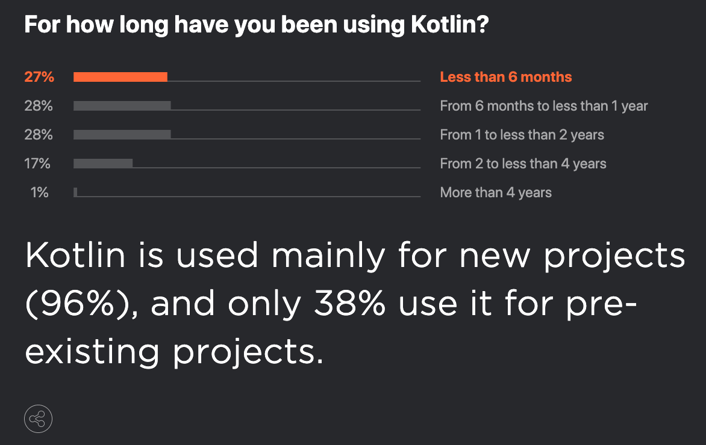
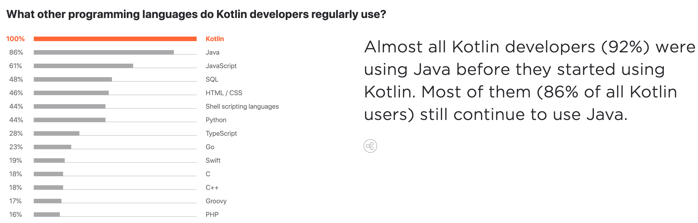
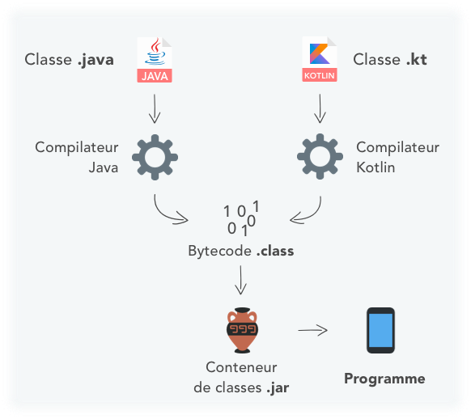
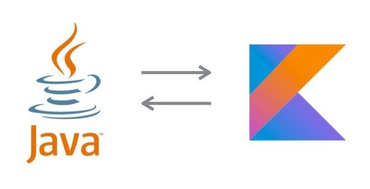
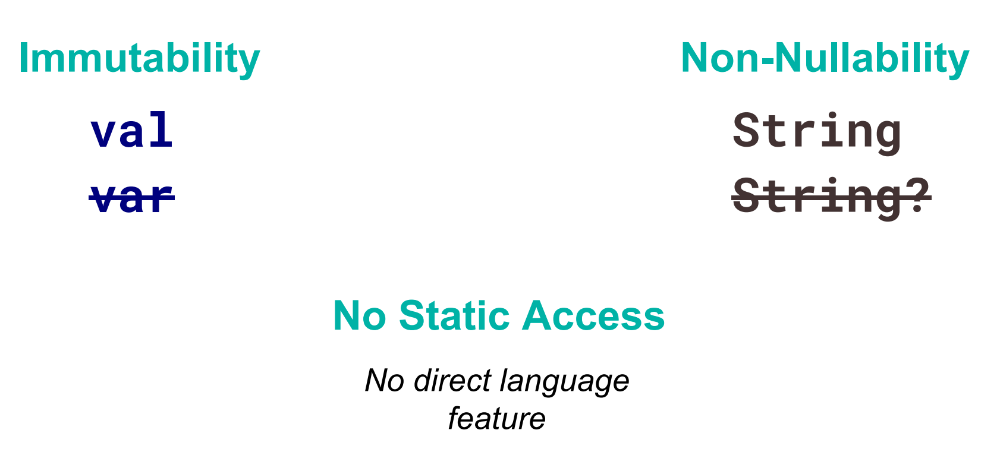
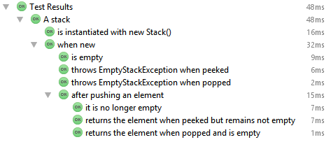
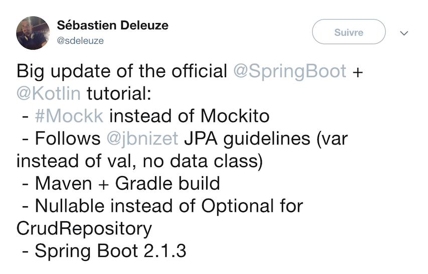
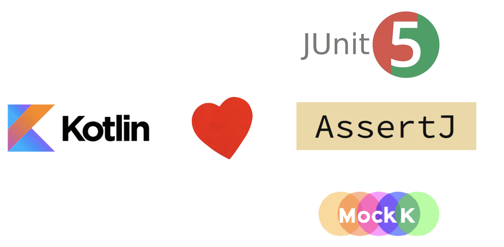

= 😍 Tester en Kotlin 
:source-highlighter: highlightjs
:revealjs_theme: white
:revealjs_history: true
:revealjs_plugin_pdf: enabled
:revealjs_plugin_highlight: enabled
:data-uri:
:icons: font

== Tu connais ?

image:images/kotlin.png[]

=== ⏱Kotlin, en quelque dates

* 2010 💡 JetBrains
* 2012 🤝 Open Source
* 2016 🚀 Kotlin `1.0`
* 2017 📱 Google I/O
* 2019 🤩 Kotlin `1.3.50`

=== 🤓Kotlin en quelques mots

[quote]
Langage statiquement *typé*, orienté *object* et *fonctionnel*, centré sur la *productivité* du développeur

=== Kotlin en quelques lignes de code

[source]
----
fun main() {
    println("Hello World!")
}
----

=== Forces du langage

* 💪_Null Safety_ 
* 👍_Immutable first_ 
* 📖Concis et expressif
* 🤝Interopabilité avec `Java`

=== Kotlin en 2019

=== Kotlin en 2019

=== Kotlin en 2019

== val me = "Benoit Prioux"

Tech Lead 

* icon:twitter[] icon:github[] binout 
* ❤️ Asciidoctor (🐜)

== { java -> kotlin }

== Pourquoi parler des tests ?

== 🎮 Un super terrain de jeu 

* 😇Pas du code de production
* 😜Plus de liberté dans le design
* 🧔Souvent un peu de code _barbant_ 
** préparation des jeux de données

== 💡Ma proposition 

[quote]
Apprendre Kotlin par les tests

[quote]
Introduire Kotlin dans votre projet par les tests

=== Java + Kotlin

=== Projet mix Java/Kotlin

. Créer `src/test/kotlin`
. Configurer build -> plugin `Maven`/`Gradle`
. Ajouter
[source]
----
    <dependency>
        <groupId>org.jetbrains.kotlin</groupId>
        <artifactId>kotlin-stdlib</artifactId>
        <version>${kotlin.version}</version>
    </dependency>
----

=== Java 🤝 Kotlin

== 📣Disclaimer

[quote]
Au cours de cette présentation, je vais aborder des concepts du langage Kotlin par des exemples issus de code de test

== 🏭Framework de test

* Un runner 
* Une librairie d'assertions
* Une librairie de mock

=== 🤨kotlin.test

* _Built-in_ librairie
** annotations (`@BeforeEach`, ....)
** assertions (`assertEquals`, ...)

* A besoin d'un runner : `Junit`, `TestNG`

=== KotlinTest

* Inspiré de `ScalaTest`
* Propose plusieurs _styles_ de test : `StringSpec`, `FunSpec`, `DescribeSpec`, ...

=== Example 

[source]
----
class MyTests : StringSpec({
  "length should return size of string" {
    "hello".length shouldBe 5
  }
  "startsWith should test for a prefix" {
    "world" should startWith("wor")
  }
})
----

== Mon avis 

* Apprendre un nouveau framework de test en plus d'apprendre un nouveau langage 🤯

=== Junit 4 & Java

[source, java]
----
public class RepoTestJUnit4 {

    private static Database db;
    private static Repository repo;

    @BeforeClass
    public void initialize() {
        db = new TestDatabase()
        db.start()
        repo = new Repository(db)
    }

    @Test
    public void foo() {
        // test repo
    }
}
----

=== Junit 4 & Kotlin

[source, kotlin]
----
class RepoTestJUnit4 {

    companion object {
        @JvmStatic
        private lateinit var db: Database
        @JvmStatic
        private lateinit var repo: Repository

        @BeforeClass
        @JvmStatic
        fun initialize() {
            db = TestDatabase()
            db.start()
            repo = Repository(db.host, db.port)
        }
    }

    @Test
    fun foo() {
        // test repo
    }
}
----

=== WTF ?

=== Kotlin, quelques notions 🤓

=== Kotlin `val`, `var`

.val 👍
[source, kotlin]
----
val language: String = "Java"
language = "Kotlin" //Compilation error
----

.var 😒
[source, kotlin]
----
var age: Int = 37
age = 38
----

=== Kotlin et null

[source, kotlin]
----
val language: String = null //Compilation error
val language: String? = null // ✅
----

[source, kotlin]
----
var age: Int? = null
age = 38
age = null
----

=== Classe en Kotlin

.💪
[source]
----
class Person(val name: String, val gender: String)
----

* _public_ par défaut
* déclaration *constructeur* en même temps que les *propriétés*

=== Kotlin : No `static`

* 😇 Pas de mot-clé `static` en Kotlin
* `companion object` = singleton associé à une classe
** permet de définir des fonctions sur cet unique instance rattaché à une classe

=== Exemple `companion object`

[source, kotlin]
----
class Person private constructor(val name: String, 
                                 val gender: String) {

    companion object {
        fun man(name: String) = Person(name, "M")
        fun woman(name: String) = Person(name, "F")
    }
}

val john = Person.man("John")
val amanda = Person.woman("Amanda")
----

=== Kotlin idiomatic

=== Junit 4 & Kotlin

[source, kotlin]
----
class RepoTestJUnit4 {

    companion object {
        @JvmStatic
        private lateinit var db: Database
        @JvmStatic
        private lateinit var repo: Repository

        @BeforeClass
        @JvmStatic
        fun initialize() {
            db = TestDatabase()
            db.start()
            repo = Repository(db.host, db.port)
        }
    }

    @Test
    fun foo() {
        // test repo
    }
}
----

=== Junit 4 : Lifecycle

[source, kotlin]
----
class RepoTestJUnit4 {

    // Exécuter pour chaque test 🔥
    private val db: Database = ...
    private val repo: Repository = ...

    // 🤯 Où mettre le code du @BeforeClass ? 
    
    @Test
    fun foo() {
        // test repo
    }
}
----

=== JUnit 5 FTW !

* Refonte totale avec financement participatif 🤝
* Nouvelle architecture 😎 : annotations, extensions

=== 🤩Junit 5 : Lifecycle

.Une seule instance pour tous les tests
[source, kotlin]
----
@TestInstance(TestInstance.Lifecycle.PER_CLASS)
class RepoTestJUnit5 {

    private val db = TestDatabase().apply { start() }
    private val repo = Repository(db.host, db.port)
        
    @Test
    fun foo() {
        // test repo
    }
}
----

=== 💡Tips Junit 5

* Changer le cycle de vie par défaut

.src/test/resources/junit-platform.properties
[source]
----
junit.jupiter.testinstance.lifecycle.default = per_class
----

=== Nommage des tests

.🐪 Camel-case
[source, kotlin]
----
@Test
fun shouldFindPersonIfQueryContainsName() { ...}
----

.〰 Snake-case
[source, kotlin]
----
@Test
fun should_find_person_if_query_contains_name() { ...}
----

=== 💡Tips en kotlin 

.backtick
[source, kotlin]
----
@Test
fun `should find person if query contains name`() { ...}
----

=== Nested inner class

[source, kotlin]
----
class RepoTestJUnit5 {

    private val db = TestDatabase().apply { start() }
    private val repo = Repository(db.host, db.port)
        
    @Nested
    inner class QueryTest {
        @Test
        fun `should find person if query contains name`() { ...}
    }

    @Nested
    inner class UpdateTest {
        @Test
        fun `should update person address`() { ...}
    }
}
----

=== Nested inner class

=== Conclusion

[quote]
Kotlin ❤️ Junit 5 

== Assertions

=== AssertJ

* 🏟 fork de `fest-assert`
* _fluent_ assertions pour (presque) tous les types

[source, kotlin]
----
assertThat(person.getName()).isEqualTo("John Doe");
----

=== 🌎Ecosystème Kotlin ?

* AssertK 
* Strikt : `expectThat(..)`

🗣
[quote]
`AssertJ` reste la référence pour les assertions

=== Tip AssertJ

.😤
[source, kotlin]
----
assertThat(personDTO.firstName).isEqual("John")
assertThat(personDTO.lastName).isEqual("Doe")
assertThat(personDTO.age).isEqual(37)
assertThat(personDTO.gender).isEqual("M")
----

.Output 🤨
[source]
----
org.junit.ComparisonFailure: expected:<[37]> but was:<[36]>
Expected :37
Actual   :36
----

=== Data Class 💡

[source, kotlin]
----
data class PersonDTO(val firstName: String, 
                     val lastName: String, 
                     val age:Int,
                     val gender: String)
----

* ✅ toString()
* ✅ equals(), hashcode()
* ✅ copy()

=== Equivalent en Java

[source, java]
----
public class PersonDTO {

    private final String firstName;
    private final String lastName;
    private final int age;
    private final String gender;

    public PersonDTO(String firstName, String lastName, 
                     int age, String gender) {
        this.firstName = firstName;
        this.lastName = lastName;
        this.age = age;
        this.gender = gender;
    }

    public String getFirstName() { return firstName;}
    public String getLastName() { return lastName;}
    public int getAge() { return age;}
    public String getGender() { return gender;}

    @Override
    public String toString() { ... }
    @Override
    public boolean equals(Object obj) { ... }
    @Override
    public int hashCode() { ... }
}
----

=== Data Class & AssertJ

[source, kotlin]
----
val expected = PersonDTO("John", "Doe", 37, "M")

assertThat(personDTO).isEqual(expected)
----

.Output 👍
[source]
----
org.junit.ComparisonFailure:
Expected :PersonDTO(firstName=John, lastName=Doe, age=37, gender=M)
Actual   :PersonDTO(firstName=John, lastName=Doe, age=36, gender=M)
----

=== Group assertions with `with`

[source, kotlin]
----
with(personDTO) {
    assertThat(firstName).isEqual("John")
    assertThat(lastName).isEqual("Doe")
    assertThat(age).isEqual(37)
    assertThat(gender).isEqual("M")
}
----

=== 🤓 `with` under the hood

[source, kotlin]
----
with(personDTO) {
    assertThat(this.firstName).isEqual("John")
    assertThat(this.lastName).isEqual("Doe")
    assertThat(this.age).isEqual(37)
    assertThat(this.gender).isEqual("M")
}
----

=== 🤓 `with` under the hood

[source, kotlin]
----
with(personDTO, {
    assertThat(this.firstName).isEqual("John")
    assertThat(this.lastName).isEqual("Doe")
    assertThat(this.age).isEqual(37)
    assertThat(this.gender).isEqual("M")
} )
----

=== 🤓 `with` under the hood

`with` -> 2 paramètres :

1. Le `receiver`
2. Une fonction avec comme _contexte_ le `receiver`

=== 😝 Autopromo

.BDX I/O 2018 : Dessine moi un DSL en Kotlin
video::2PDiZsw4YhE[youtube, options=autoplay]

=== Conclusion

Kotlin ❤️ AssertJ

== Mock and co

image:images/mock.png[]

=== 👻 Mockito ?

* ⚠️ `when` mot clé réservé en `Kotlin`
* 😭 `mockito` ne sait pas mocker les classes _finales_
** incubating extensions : `mock-maker-inline`, `mockito-kotlin`

=== 👍 Kotlin et `final`

* Les classes sont *finales* par défaut

* Il faut utiliser le mot-clé `open` pour explicitement autoriser l'héritage

=== Mockito et Kotlin ?

Plusieurs solutions pour les classes que l'on veut mocker : 

1. 🤨 Ajouter le mot-clé `open` 
2. 😩 Définir des interfaces 

=== Alternative 👻 Mockk

.Syntaxe DSL élégante avec toutes les fonctions de `Mockito`

=== Exemple

.Mockito
[source, kotlin]
----
`when`(repo.findByName("John")).thenReturn(Person("John", "Doe"))
----

.Mockk
[source, kotlin]
----
every { repo.findByName("John") } returns Person("John", "Doe")
----

=== Spring : Mockito -> Mockk

=== Mockk et Junit5

[source, kotlin]
----
class PhoneBookTest {

    private lateinit var repo: PersonRepository
    private lateinit var phoneBook: PhoneBook

    @BeforeEach
    fun init() {
        repo = mockk()
        phoneBook = PhoneBook(repo)
    } 

    @Test
    fun `should list contacts`() { 
        every { repo.findByName("John") } returns Person("John", "Doe")
        ...
    }
    
}
----

=== lateinit var

* 🤓 Permet d'indiquer que la propriété sera initialisé par quelqu'un (framework d'injection) avant son utilisation
* ⚠️ Lance une exception lors de l'accès si pas initialisé
* 💡 Permet d'éviter d'utiliser un type _nullable_

=== Créer des mocks, ça coûte 💵

* Il faut éviter l'instanciation d'un mock avant chaque test 
** 🐌 car ça ralentit les tests !

=== La solution 

.😎 clearMocks()
[source, kotlin]
----
class PhoneBookTest {

    private val repo = mockk<PersonRepository>()
    private val phoneBook = PhoneBook(repo)

    @BeforeEach
    fun init() {
        clearMocks(repo)
    } 

    @Test
    fun `should list contacts`() { 
        every { repo.findByName("John") } returns Person("John", "Doe")
        ...
    }
    
}
----

=== Conclusion

[quote]
Kotlin 💔 Mockito  

[quote]
Kotlin ❤️ Mockk  

== En résumé

//== Misc Tips

//* Helper methods with default argument
//* DSL pour construire les jeux de données
//* Infix méthode 
//* Méthodes d'extensions pour simplifier la construction de jeu de donnée (ex "42,S,M".toSize())
//* String Template """ """

== Alors convaincu ?

== Retour d'expérience

* Projet actuel (2 ans et 1/2)
** ☕️ `60 000` LOC en java (7 microservices)

* Depuis 1 an 
** 🤓 Apprentissage puis migration Kotlin

* 🤩 Aujourd'hui 
** 5 microservices en full kotlin
** 2 autres en cours de migration

== LE chiffre

== Et sans perte de lisibilité ! 

* `dataclass` (`ValueObject` en DDD)

* Boilerplate code 📉

.Java Stream
[source, java]
----
persons.stream()
    .map(p -> p.getName() + "-" + p.getAge())
    .collect(Collectors.toList())
----

.Kotlin
[source, kotlin]
----
persons.map { "${it.name}-${it.age}" }
----

== Lundi matin 👇

* Pré-requis: `Junit 5`, `Intellij`

* 🚀 Etapes

1. Configurer `maven`/`gradle` pour Kotlin
2. Créer `src/test/kotlin` 
3. Ajouter la dépendance `mockk`

== Pour aller plus loin

* 📝 Tech Blog Lectra
** https://tech-blog.lectra.com/

* 🎮 Kotlin Koans
** https://play.kotlinlang.org/koans/overview

== Merci !

.https://openfeedback.io/
